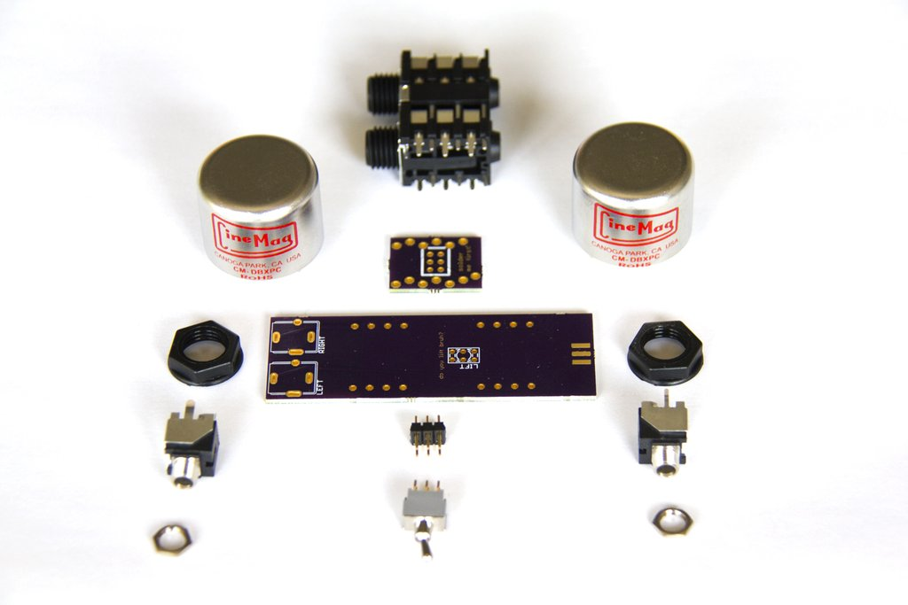
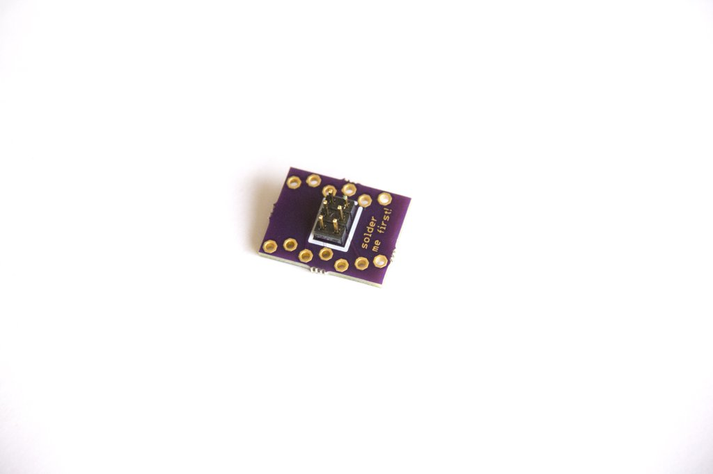
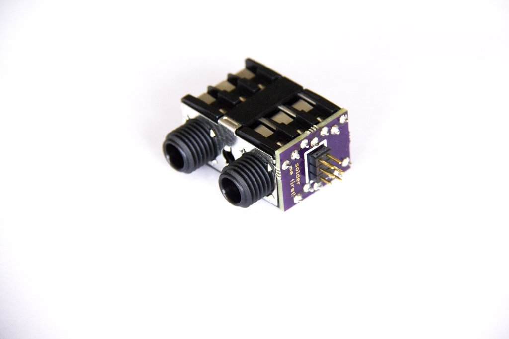
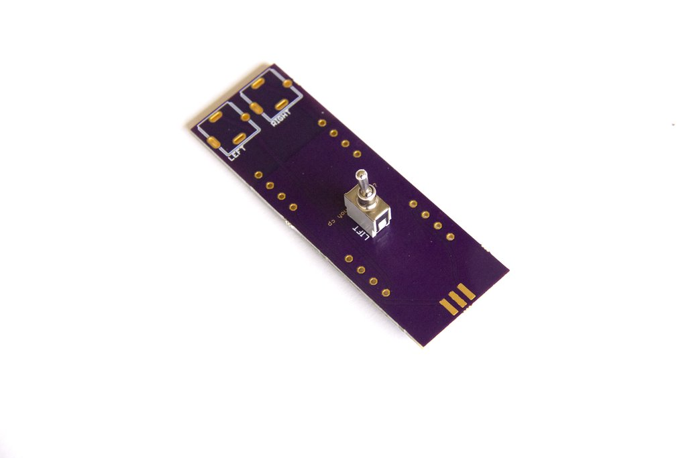
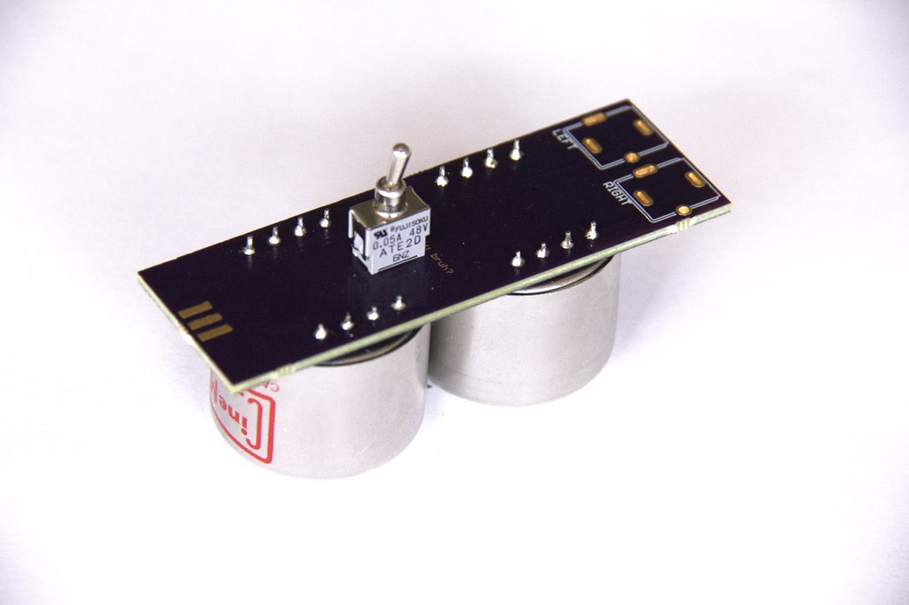
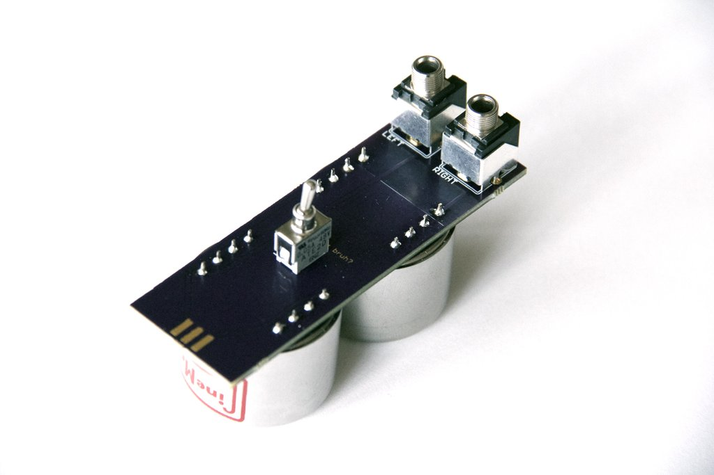
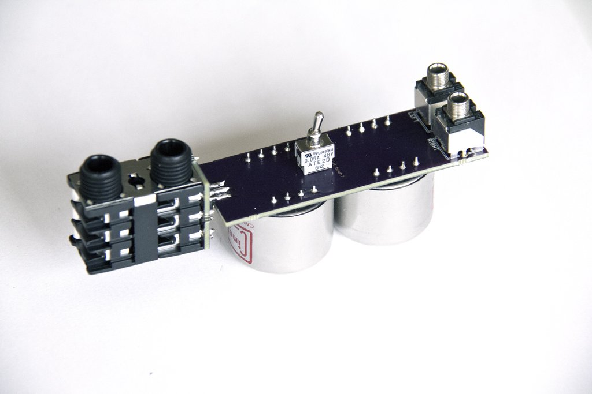

# RIP Build Guide

Transformer based, based signal level transformer: rip modular audio down to some kind of signal level with your own home-built RIP.

This guide will walk you through the steps necessary for building your own.  It is a great first DIY project!

We recommend grouping up with other builders, since you will need to order a minimum of 3 PCBs, and Cinemag will not accept orders for just 2 transformers.

## Parts  & Tools

You will need the following to complete this build:

1. [Base PCB](https://oshpark.com/shared_projects/XV3uuEyj)
2. [Head PCB](https://oshpark.com/shared_projects/YRoWpgCe)
3. [BOM](https://octopart.com/bom-tool/D3BJBFqb) (*NB: Please don't contact Cinemag for just two transformers.  Group with some friends to collectively buy enough for several modules!*)
4. [Panel Illustrator File](https://github.com/whimsicalraps/MannequinsPanels)
5. Electrical tape or masking tape.
6. Soldering station and related tools

## Step 1

First, solder the 6-pin header to the head board.  Make sure that the shorter legs of the header go through the pinholes, not the longer legs.  The black plastic on the header should be on the same side as the board's white rectangle silkscreen marking.

After soldering the header, clip the pins on the side you just soldered.

## Step 2

Next, solder the 1/4" jacks to the small board.  These have only one possible orientation on the board, so they can't be inserted incorrectly.  Check the number of legs on each side and it should snap right in once you orient it!

## Step 3

Time to move to the larger board.  First, place the switch on the top side of the board.  After soldering the switch, trim its pins and then tape over the pads on the back side of the board.

***It is critical that you remember to tape over the pads on the back side of the circuit board so that the legs of the switch do not short out the transformers!  Once you solder the transformers in the next step, you will no longer be able to place the tape.***

## Step 4

Place the transformers on the back side of the board (opposite side from the switch).  Be careful to line up the red dot on the transformers with the white dot on the board's silkscreen.

## Step 5

Add the 1/8" jacks.  They only have one possible alignment, so they can snap right in once they have been aligned!

## Step 6

Join the two boards together by sliding the larger board in between the header pins on the small board.  

Make sure the two boards are oriented so that the 1/4" jacks and 1/8" jacks are facing the same direction!  

You should solder one pin, then reheat and adjust the alignment until satisfactory before moving on to the other five pins.

## Finale

Finish up by putting your custom panel on and securing it with nuts on both the 1/8" and 1/4" jacks!

